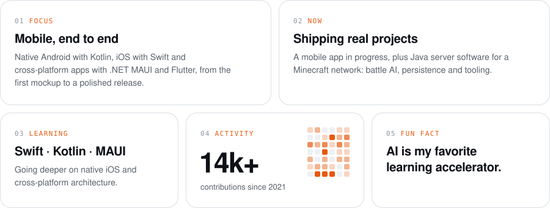
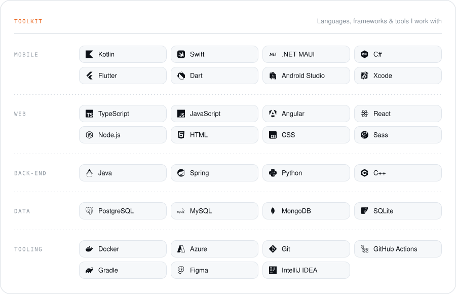

<picture>
  <source media="(prefers-color-scheme: dark)" srcset="./assets/hero-dark.svg" />
  
</picture>
  

  &nbsp;
  

 

<picture>
  <source media="(prefers-color-scheme: dark)" srcset="./assets/about-dark.svg" />
  
</picture>

 
 

<picture>
  <source media="(prefers-color-scheme: dark)" srcset="./assets/stack-dark.svg" />
  
</picture>
